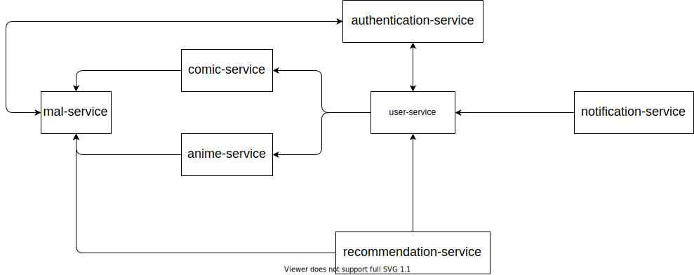

# Arquitetura de microsserviços

> ## **Motivações**

- Necessidade de uma **arquitetura desacoplada de linguagem de programação**: criar várias aplicações ou também uma mesma aplicação, porém com linguagens ou frameworks diferentes, afim de colocar em prática (em uma aplicação mais complexa) meus conhecimentos sobre a tecnologia em questão

- **Aplicação extensível e escalável** para uma possível implantação no ambiente de produção

- **Independência entre as aplicações**, evitando a queda de todo o sistema por causa de uma **manutenção**

- **Isolamento e flexibilidade na criação de esteiras CI/CD** (DevOps)

> ## **Visão geral**

